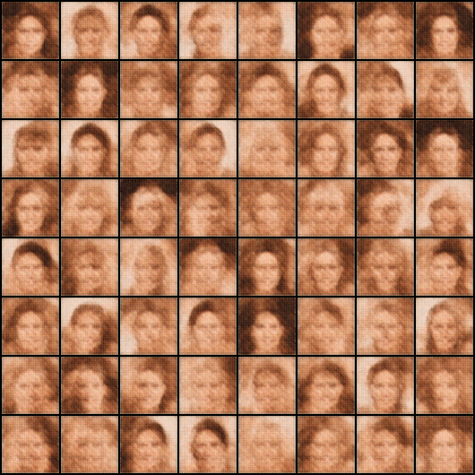
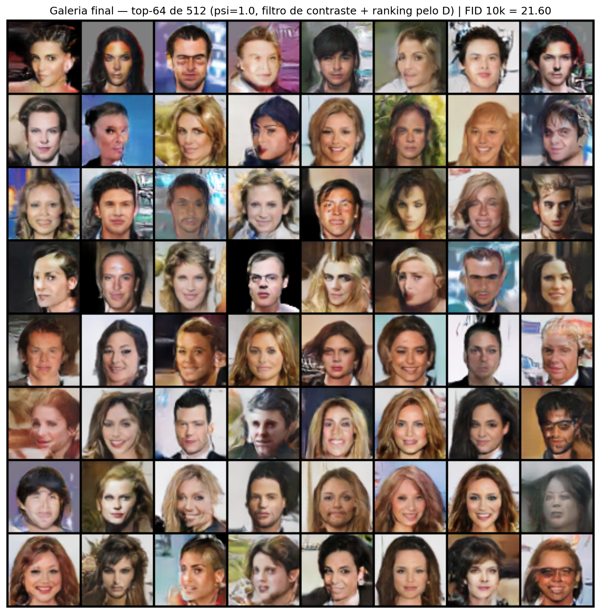
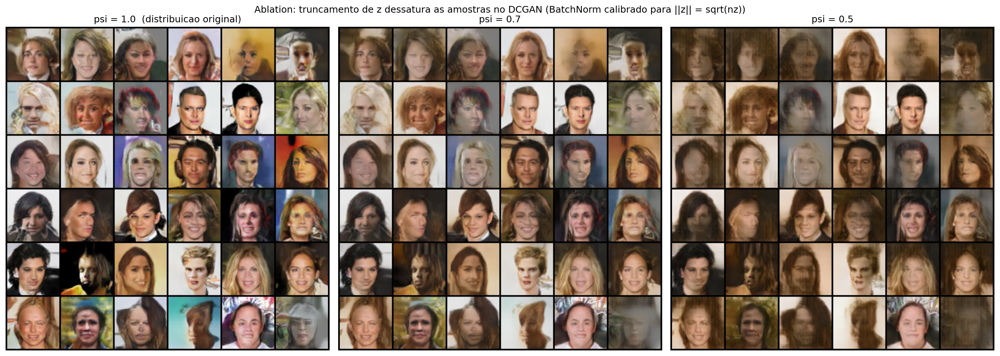
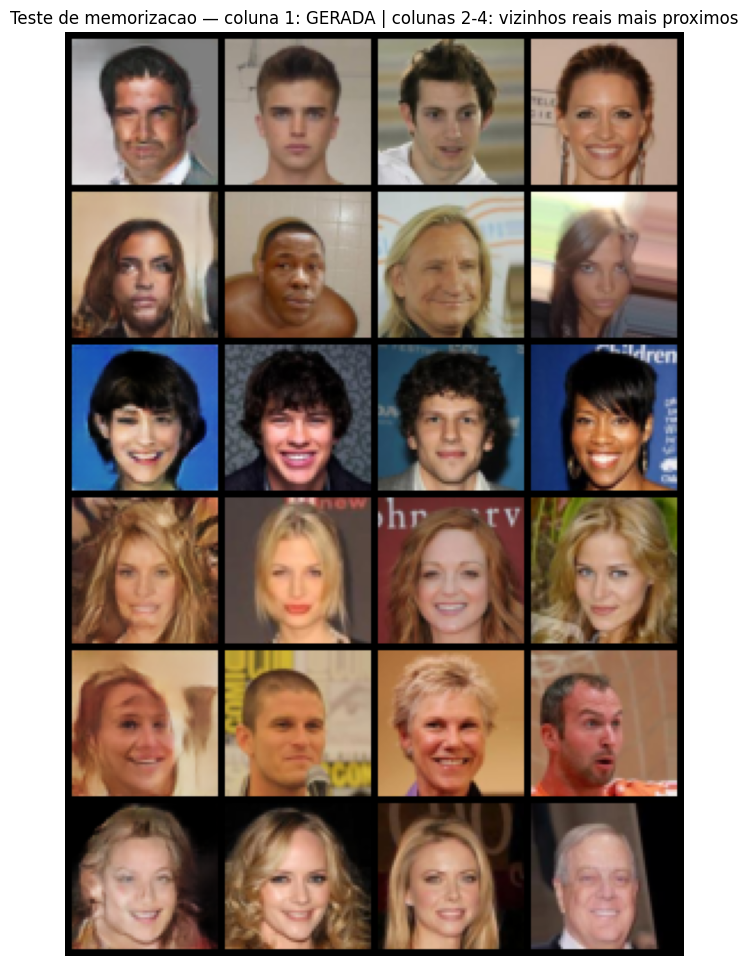
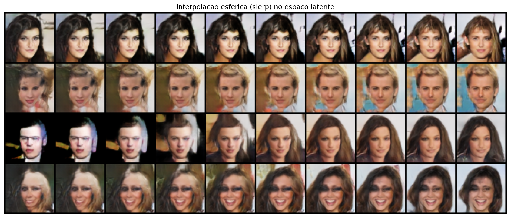

# DCGAN de Alta Performance — Geração de Rostos com CelebA
**Caio Simões dos Santos**

> **Projeto 4 — Deep Learning (DCGAN + VAE)** · Geração de rostos humanos que não existem, com avaliação quantitativa rigorosa.



*Evolução do Gerador ao longo de 40 épocas — mesmo ruído fixo em todos os frames.*

## Resultados

| Métrica | Valor |
|---|---|
| **FID (10.000 imagens)** | **21.60** |
| FID em três execuções independentes (do zero) | 21.99 / 21.89 / 21.60 — **pipeline reprodutível** |
| Épocas | 30 (treino principal) + 10 (fine-tuning com lr decay linear até 0) |
| Equilíbrio do jogo | lossD ≈ 1.37 ≈ 2·ln 2 e D(real) ≈ D(fake) ≈ 0.5 durante todo o treino (equilíbrio de Nash) |
| Dataset | CelebA — 202.599 rostos alinhados, 64×64 |
| Hardware | 1× NVIDIA T4 (Google Colab), ~3.5h por execução completa |



*Top-64 de 512 amostras (ψ=1.0), com curadoria declarada: filtro de contraste + ranking pelo Discriminador. Nenhuma destas pessoas existe.*

## Técnicas

A arquitetura DCGAN original (Radford et al., 2015) sozinha produz imagens borradas. As técnicas abaixo são o que separa este resultado de um tutorial básico:

| Técnica | Função |
|---|---|
| **EMA do Gerador** (decay 0.999) | Toda amostragem e o FID usam a média móvel dos pesos — o maior ganho de qualidade isolado |
| **DiffAugment** (Zhao et al., 2020) | Augmentation diferenciável (color, translation, cutout) em reais e fakes — estabiliza o Discriminador |
| **Spectral Normalization** (Miyato et al., 2018) | No Discriminador, sem BatchNorm — previne colapso de modo |
| **One-sided label smoothing** (real = 0.9) | Impede o Discriminador de ficar superconfiante |
| **Fine-tuning com lr decay linear até zero** | Polimento final: FID ~25.7 → ~21.6 |
| **FID com 10k imagens** | Avaliação quantitativa padrão da literatura |

## Achados além do básico

**1. Resultado negativo documentado — o truncation trick não transfere para o DCGAN.**
A ablation (ψ = 1.0 / 0.7 / 0.5) mostra que truncar o vetor latente *dessatura* as amostras em vez de melhorá-las. Explicação: em 128 dimensões a gaussiana concentra-se na casca ‖z‖ ≈ √128 (concentração de medida); os BatchNorms do Gerador são calibrados para essa casca, e z·ψ com ψ<1 cai numa região nunca vista no treino. BigGAN/StyleGAN não sofrem disso por terem BatchNorm condicional / mapping network.



**2. Teste de memorização (nearest neighbors).**
Para cada rosto gerado, os 3 vizinhos reais mais próximos (L2 em 20k imagens) são pessoas diferentes — o modelo aprendeu a distribuição, não decorou exemplos.



**3. Interpolação esférica no espaço latente.**
Transições suaves entre rostos coerentes confirmam uma variedade contínua aprendida.



## Como reproduzir

1. Abra `DCGAN_CelebA.ipynb` no Google Colab com GPU (T4 basta).
2. `Runtime → Run all`. O notebook baixa o CelebA via `kagglehub`, monta o Google Drive para persistir checkpoints e treina do zero (~3.5h).
3. **Tolerante a quedas de sessão:** o checkpoint é salvo a cada época no Drive; se a sessão cair, basta dar `Run all` de novo — o treino retoma exatamente de onde parou (treino principal e fine-tuning).
4. Ao final, a última célula gera `dcgan_assets.zip` com todas as figuras, o GIF e os pesos do Gerador EMA.

```bash
pip install -r requirements.txt   # para rodar localmente (GPU recomendada)
```

## Estrutura do repositório

```
├── DCGAN_CelebA.ipynb      # notebook completo, executado, com todos os outputs
├── assets/                 # figuras, GIF e pesos finais (generator_ema_final.pt)
├── requirements.txt
└── README.md
```

## Referências

1. Radford, A., Metz, L., Chintala, S. (2015). *Unsupervised Representation Learning with Deep Convolutional GANs.*
2. Miyato, T. et al. (2018). *Spectral Normalization for Generative Adversarial Networks.*
3. Zhao, S. et al. (2020). *Differentiable Augmentation for Data-Efficient GAN Training.*
4. Brock, A., Donahue, J., Simonyan, K. (2019). *Large Scale GAN Training for High Fidelity Natural Image Synthesis (BigGAN).*
5. Heusel, M. et al. (2017). *GANs Trained by a Two Time-Scale Update Rule Converge to a Local Nash Equilibrium (FID).*
6. Goodfellow, I. et al. (2014). *Generative Adversarial Networks.*
